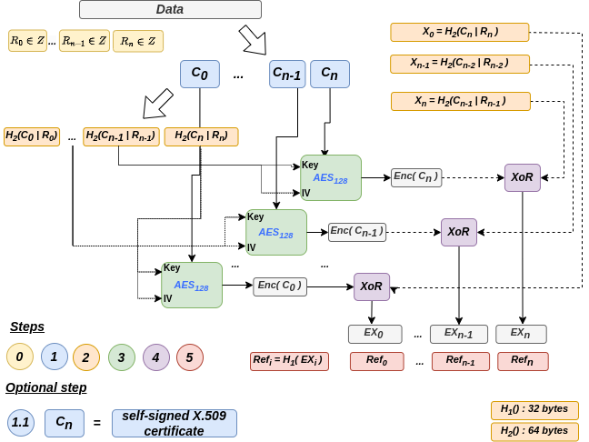

# New-Design-for-Self-Encryption

The basic goal of the original self-encryption was to create a strong ciphertext without user intervention or passwords" [[1]](#1). As the plaintext may not provide the necessary randomness, the first stage of the encryption of the data provided by the AES blocks is not provably secure. The authors of the original self-encryption claimed that their implementation should be considered as an OTP. However, the keys used for the $One-Time-Padding$ operation were not random, which is an essential requirement of the perfect secrecy provided by an OTP. 

In **our implementation**, the aforementioned issues are addressed to obtain a provably secure self-encryption method, and providing at least a security of $2^{r}$, where $r$ is 512 bits.

**Our implementation** is enriched with two possible encryption methods:
<br></br>

 *  **Default mode** allows the specification of the number of chunks the data must be divided into, providing a security level of $2^{r}$ with $r$ equal to 512 bits. 
 *  **OTP-like mode** creates 48 byte-long chunks that are AES encrypted and XOR-ed with 64 byte-long keys, providing a security level close to the $perfect$ $secrecy$. As another significant improvement, the weak secret key generation is amplified by using Privacy Amplification by applying additive randomness  to the plaintext and SHA-2 cryptographic hash function.

<br></br>

The following figure shows the main steps of our self-encryption method:
<br></br>

<p align="center">
  
</p>

<br></br>

This work was presented as an invited paper at the International Symposium on Intelligent and Trustworthy Computing, Communications, and Networking organized in conjunction with the 22nd IEEE International Conference on Trust, Security and Privacy in Computing and Communications (TrustCom-2023), 1-3 Nov, Exeter, UK

# USAGE 
We recommend that you use for the encryption:
```bash
 ./start_test_encryption.sh
```
and for the decryption 
```bash
 ./start_test_decryption.sh
```
bash scripts.

* For the encryption process you also have to provide a secret key and a X.509 certificate. An example of the secret key is provided under: `data/test2/MSP/keystore/sk.pem` and an X.509 certificate under `data/test2/signcerts/cert.pem`


# ACKNOWLEDGMENTS
This research is supported by European Union’s Horizon 2020 research and innovation programme under grant agreement No. 101021727 (IRIS), and No. 101070052 (TANGO).

## REFERENCES
<a id="1">[1]</a> 
D. Irvine (2010). 
Self encrypting data.
